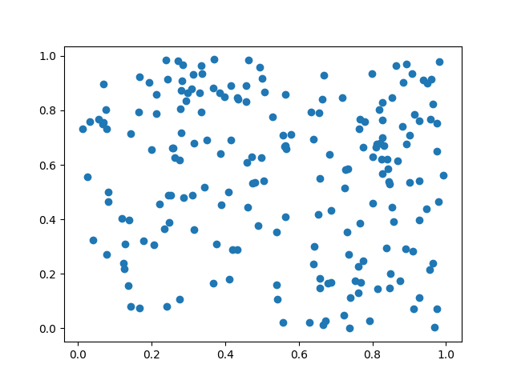
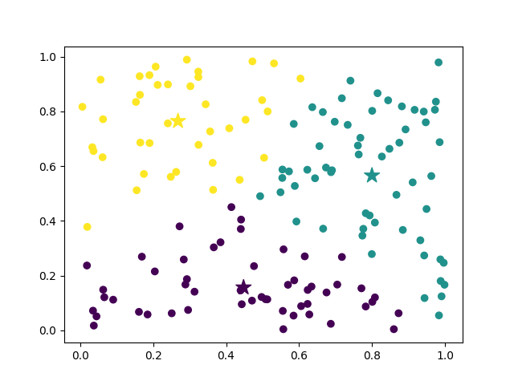

# K-Means-Code 
Implementation of K Means Algorithm in Python 

## Getting Started  
### Pre Requisites   
pandas  
numpy  
matplotlib   

### Usage 
1. #### Using main.py  
Takes 3 arguements length of sample data `number_of_datapoints` , number of clusters `number_of_clusters` and number of iteration to perform`number_of_iterations`
 ```  
 python main.py number_of_datapoints number_of_clusters number_of_iterations  
 ```

2. #### Using simplekmeans.py  
File Contains kmeans function def `KMeans(data,k,iters)` and sample usage
```
data=np.random.rand(100,2)
labels,centroids=KMeans(data,4,20)
```

## File Guide  

- Folder: `code-at-1-hour-mark` -> contains the code at 1 hour mark    
- File: `simplekmeans.py` -> contains function that fits data on specified clusters and iterations   
- File: `main.py` -> use this file to run program , specify the number of datapoints to randomly generate, number of clusters and number of iterations    
- File: `algorithm/mlearn.py` -> contains KMeans class used by main.py  
- Folder: `output` -> contains output of main.py ie plots,data files  

## Functionality
1. Generate data points
2. Calculate kmeans
   1. select k random points from data
   2. repeat until iterations
      1. initialize centroids with points selected in above step
      2. assigning data points to centroids
      3. re initialize centroids with mean of selected data points
   3. return labels,centroids 
3. Make corresponding plots and save data to output dir

## Plots
### Initial Data 
   

### Label generated against specified iterations and clusters 
  
 
 

  
