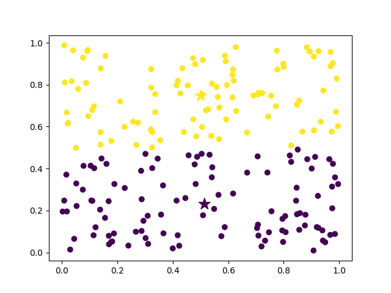

# K-Means-Code 
Implementation of K Means Algorithm in Python 
# Functionality
- Program generates n datapoints specified in arguements 
- Initialize KMeans with number of clusters and max iterations 
- Fits the datapoints generated  
- Generate a plot with datapoints, centroids and labels and saves to output dir 
- Saves raw data as well as data with labels to output dir 

## Initial Data 
  

## Label generated against specified iterations and clusters 
  

# Library Requirements  
pandas  
numpy  
matplotlib   
 
# Execute 
- File takes 3 arguements  
 `python main.py number_of_datapoints number_of_clusters number_of_iterations`

