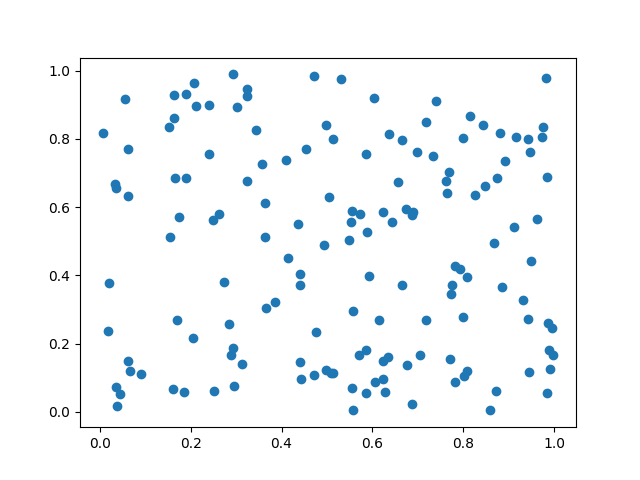

# K-Means-Code 
Implementation of K Means Algorithm in Python 

# File Guide  

- Folder: code-at-1-hour-mark -> contains the code at 1 hour mark    
- File: simplekmeans.py -> contains function that fits data on specified clusters and iterations   

- File: main.py -> use this file to run program , specify the number of datapoints to randomly generate, number of clusters and number of iterations    
- File: algorithm/mlearn.py -> contains KMeans class used by main.py  
- Folder: output -> contains output of main.py ie plots,data files  

# Functionality
- Program generates n datapoints specified in arguements 
- Initialize KMeans with number of clusters and max iterations 
- Fits the datapoints generated  
- Generate a plot with datapoints, centroids and labels and saves to output dir 
- Saves raw data as well as data with labels to output dir 

## Initial Data 
  

## Label generated against specified iterations and clusters 
  

# Library Requirements  
pandas  
numpy  
matplotlib   

  
# Execute 
- File takes 3 arguements  
 `python main.py number_of_datapoints number_of_clusters number_of_iterations`

